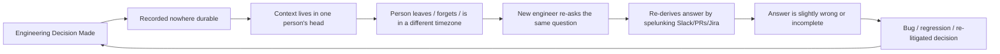
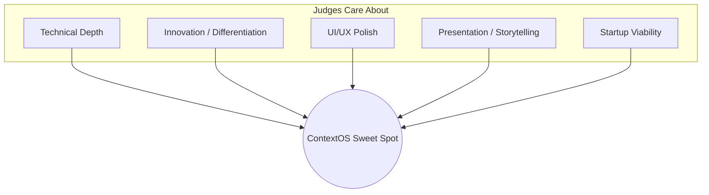

# CONTEXTOS — PROJECT BIBLE

*Internal Engineering Documentation — NitroStack Hackathon 2026*

---

# PART 1 — EXECUTIVE SUMMARY

## 1.1 Vision

> **Git stores code. GitHub stores collaboration. ContextOS stores engineering knowledge.**

ContextOS is the **Agentic Engineering Operating System** — an MCP-native AI teammate that continuously observes an engineering organization's activity across GitHub, Slack, docs, CI/CD, and local files, and answers any engineering question with evidence, citations, and recommended action.

Five years from now, no engineering org should have to ask "why did we build it this way?" and get silence. ContextOS is the permanent, queryable memory layer that makes that question always answerable.

## 1.2 Mission

Transform fragmented, decaying engineering knowledge into a single, always-current, explainable AI teammate — one that:

| Capability | What it means |
|---|---|
| **Retrieves** | Pulls only the relevant evidence via MCP — never bulk-dumps repos, Slack history, or docs into context |
| **Reasons** | Uses Claude to synthesize retrieved evidence into an answer |
| **Explains** | Every answer is traceable to its source — no unexplained conclusions |
| **Cites** | Every claim links back to a PR, commit, message, or doc |
| **Predicts** | Surfaces likely blast radius / impact before a change is made |
| **Recommends** | Suggests concrete next actions (reviewers, rollback plans, docs to update) |
| **Remembers** | Persists what it learns so the org never re-derives the same knowledge twice |

## 1.3 Problem Statement

### The core problem: Engineering Alignment Tax

Every growing engineering org pays a hidden, compounding tax:

This tax shows up as:

- **Onboarding drag** — new hires take weeks to understand *why*, not just *what*
- **Silent knowledge decay** — Slack threads and tribal knowledge vanish or go stale
- **Repeated mistakes** — the same architectural debate happens twice because the first resolution wasn't durable
- **Fear-driven changes** — engineers avoid touching code they don't understand the history of
- **Fragmented tooling** — the answer to "why Redis?" is split across GitHub, Slack, Notion, and someone's memory

### Why existing tools don't solve this

| Tool category | What it does | What it's missing |
|---|---|---|
| GitHub / GitLab | Stores code + PR history | No cross-system reasoning, no "why" synthesis |
| Slack | Stores conversation | Unsearchable at the concept level, decays fast |
| Notion / Confluence | Stores docs | Goes stale the moment no one updates it |
| GitHub Copilot / code AI | Suggests code | No organizational memory, no cross-source reasoning |
| Generic RAG chatbot | Semantic search + LLM | Retrieves *documents*, not *engineering evidence*; no citation discipline; no impact/ownership reasoning |

ContextOS is explicitly **not** another one of these. It is the reasoning + memory layer that sits *above* all of them.

## 1.4 Product Philosophy

These are non-negotiable design principles that every later section must respect:

1. **Evidence before answers.** Claude never answers from parametric memory about the codebase — every claim is grounded in retrieved MCP evidence with citations. Hallucinated project history is treated as a P0 bug class.
2. **Retrieve narrow, reason deep.** MCP tools fetch the minimum relevant slice (a PR, a thread, a doc section) — never a full repo, full Slack export, or full doc corpus. This is a cost, latency, *and* accuracy strategy (see Part 3, Token Strategy).
3. **Memory compounds.** Every question ContextOS answers should make the next equivalent question cheaper and faster to answer, via the Memory Manager.
4. **Explainability is a feature, not a debug log.** Citations and reasoning traces are shown to the user by default, not hidden behind a toggle — this is core to trust and to the demo.
5. **Elegant over exhaustive.** We support a curated set of MCP servers deeply (GitHub, Slack, Filesystem) rather than a shallow integration with everything. Depth wins demos; breadth is Future Vision.
6. **Demo-first engineering.** Every feature we build in the 24-hour window must map to a moment in the three demo flows (see Demo Script, later in this Bible). If a feature doesn't show up in the demo, it's out of scope for the hackathon build.

## 1.5 Hackathon Winning Strategy

### 1.5.1 How hackathon judges actually score

Based on standard hackathon judging rubrics (technical execution, innovation, design/UX, presentation, potential impact), we optimize deliberately for the intersection of these:

### 1.5.2 Our specific wedge

| Lever | Our approach | Why it wins |
|---|---|---|
| **Technical depth** | Real multi-agent pipeline (Planner → Retriever → Context Builder → Reasoning → Reflection → Memory), real MCP servers, real citations — not a single-prompt wrapper | Judges can see under the hood; it survives technical Q&A |
| **NitroStack showcase** | Deep use of decorator-based Tools, NitroStudio live debugging, streaming tool calls, Ops Canvas visualization | Directly rewards "best use of NitroStack" criteria most hackathons include |
| **Innovation** | Reframe the category: not "AI chatbot for docs" but "Engineering Operating System" — a new noun, not a feature | Differentiation is remembered; "another RAG chatbot" is not |
| **UI/UX** | One polished, cinematic demo surface (chat + live knowledge graph + execution trace) rather than five half-built screens | Judges reward finish over feature count |
| **Storytelling** | Three scripted demo moments that build a narrative arc: *understand → predict → remember* | Structured narrative outperforms a feature tour |
| **Startup potential** | Explicit path from hackathon MVP to enterprise platform (see Startup Vision, later in this Bible) | Judges (often VCs) reward "this could be a company" |

### 1.5.3 What we explicitly will NOT build for the hackathon

To protect reliability (see Development Principles), the following are intentionally **out of scope** for the 24-hour build, and will be labeled **Future Vision** wherever they recur later in this Bible:

- Jira, Notion, Google Drive, Calendar, Database, and Terminal MCP servers (real integrations) — GitHub, Slack, and Filesystem MCP are the only **MVP** servers
- Multi-tenant auth / enterprise SSO
- Fine-grained permissions and audit logging
- Full historical backfill / continuous background indexing at scale
- Production-grade horizontal scaling of the Retriever

These will still appear in the Bible as documented **architecture-ready** extension points, but not as hackathon deliverables — this shows judges depth of thinking without risking demo-day reliability.

### 1.5.4 Section-classification convention used throughout this Bible

Every feature elsewhere in this document will be tagged:

| Tag | Meaning |
|---|---|
| **MVP** | Must exist and work live in the demo |
| **Recommended** | Build if time allows after MVP is demo-solid |
| **Stretch Goal** | Only after Recommended is done and MVP is bulletproof |
| **Future Vision** | Documented for judges/investors, not built during the hackathon |

---

**NitroStack verification note for this section:** No NitroStack-specific commands, APIs, or Studio behavior were referenced in Part 1. Verified product facts used for framing in later parts (confirmed via official sources: nitrostack.ai, docs.nitrostack.ai, github.com/nitrocloudofficial/nitrostack): NitroStack is a TypeScript, decorator-based MCP framework (`@McpApp`, `@Module`, `@Tool`, `@UseGuards`, `@Cache`, `@Widget`), with a CLI, NitroStudio (visual desktop MCP testing/debugging app), and NitroCloud (managed deployment). Specific CLI command syntax and Ops Canvas behavior will be marked **Assumption — verify against official NitroStack documentation** when first used in the architecture sections.

---

END OF PART 1

Awaiting Continue
