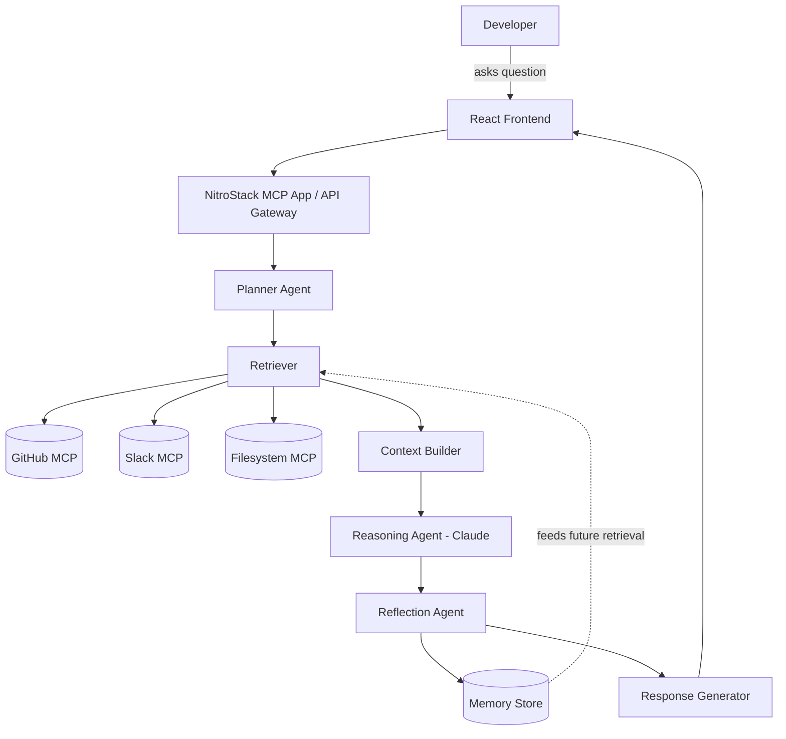

# PART 2 — SYSTEM ARCHITECTURE

## 2.1 High-Level Architecture



## 2.2 AI Pipeline — Agent Responsibilities

| Agent | Input | Output | Responsibility |
|---|---|---|---|
| **Planner** | Raw user question | Ordered tool-call plan | Decides *which* MCP servers/tools are needed and in what order. Never fetches data itself. |
| **Retriever** | Plan | Raw evidence chunks | Executes MCP tool calls, applies relevance filtering (top-k, recency, code-path relevance) |
| **Context Builder** | Raw evidence | Structured, deduplicated context bundle with source metadata | Normalizes evidence into a citation-addressable format (`sourceId`, `type`, `excerpt`, `url`) |
| **Reasoning Agent** | Context bundle + question | Draft answer with inline citation markers | Claude call — the only step allowed to "think"; grounded strictly in the bundle |
| **Reflection Agent** | Draft answer | Verified answer or re-plan signal | Checks every claim maps to a citation; if not, triggers Planner re-loop (max 1 retry in MVP) |
| **Memory Manager** | Verified answer + evidence | Persisted memory record | Writes a durable "engineering memory" entry so future equivalent questions skip retrieval |
| **Response Generator** | Verified answer | Formatted UI payload | Adds citation links, confidence, suggested follow-ups |

**Engineering rationale:** Splitting Planner from Retriever from Reasoning keeps each Claude call small and single-purpose — this is a direct implementation of the Token Strategy (Part 1, Context Pack) and keeps prompt-cache hit rates high (system/tool-definition prefix stays constant across calls).

**Alternative considered:** Single-agent "ReAct-style" loop where one Claude call both plans and reasons.
**Why rejected:** Harder to demo the pipeline visually (a core judge-facing asset via NitroStudio's execution trace), harder to enforce citation discipline, and a single long-context call defeats the retrieve-narrow strategy.

## 2.3 Folder Structure (MVP)

```
contextos/
├── apps/
│   ├── server/                 # NitroStack MCP App (Dev 1 + Dev 3)
│   │   ├── src/
│   │   │   ├── modules/
│   │   │   │   ├── planner/
│   │   │   │   ├── retriever/
│   │   │   │   ├── context-builder/
│   │   │   │   ├── reasoning/
│   │   │   │   ├── reflection/
│   │   │   │   └── memory/
│   │   │   ├── mcp-clients/
│   │   │   │   ├── github.client.ts
│   │   │   │   ├── slack.client.ts
│   │   │   │   └── filesystem.client.ts
│   │   │   ├── tools/          # @Tool-decorated ContextOS tools
│   │   │   └── app.module.ts
│   │   └── package.json
│   └── web/                    # React frontend (Dev 4)
│       ├── src/
│       │   ├── components/
│       │   │   ├── ChatPanel/
│       │   │   ├── KnowledgeGraph/
│       │   │   ├── ExecutionTrace/
│       │   │   └── CitationCard/
│       │   └── pages/
│       └── package.json
├── packages/
│   └── shared-types/            # Zod schemas shared server/web (Dev 2)
├── docs/
│   └── contextos-project-bible/ # this Bible
└── README.md
```

## 2.4 Database Considerations

**MVP choice: SQLite (local) or a single hosted Postgres instance.**

| Table | Purpose |
|---|---|
| `memory_entries` | Persisted Q→A pairs with citations, embeddings, timestamp, source hash |
| `context_nodes` | Graph nodes: files, PRs, services, people, decisions |
| `context_edges` | Graph edges: `depends_on`, `owns`, `discussed_in`, `implements` |
| `evidence_cache` | Short-TTL cache of raw MCP responses to reduce duplicate calls during a demo run |

**Tradeoff:** A real vector DB (pgvector, Pinecone) is **Recommended**, not MVP — for a single-repo hackathon demo, in-memory cosine similarity over a few hundred embeddings is simpler, faster to build, and has zero external dependency risk on demo day. Swapping to pgvector is a documented **Future Vision** upgrade path (see Part 9, Scalability).

## 2.5 Security Considerations (MVP scope)

- All MCP server credentials (GitHub PAT, Slack bot token) loaded from environment variables, never committed, never sent to Claude.
- Reasoning Agent receives only *retrieved excerpts*, never raw credentials or full API responses.
- **Assumption — verify against official NitroStack documentation:** NitroStack's `@UseGuards` decorator (confirmed to exist in the SDK) is assumed to support a simple API-key guard suitable for gating the ContextOS tool endpoints during the demo; exact guard configuration syntax should be verified in `docs.nitrostack.ai` before Hour 1 implementation.

## 2.6 Testing Strategy (MVP scope)

| Layer | Test approach | Owner |
|---|---|---|
| MCP clients | Contract tests against recorded fixture responses (avoid live API flakiness during demo prep) | Dev 3 |
| Planner | Unit tests: given question → expected tool plan | Dev 1 |
| Reflection Agent | Unit tests: answer with unsupported claim → must trigger re-plan | Dev 1 |
| End-to-end | Scripted "golden path" runs of all 3 demo questions, run repeatedly the morning of demo day | Dev 2 + Dev 4 |

## 2.7 Risks

| Risk | Mitigation |
|---|---|
| Live GitHub/Slack API rate limits or outage during demo | Pre-fetch and cache all demo-path evidence the night before; fall back to cached `evidence_cache` if live call fails |
| Claude reasoning latency during live demo | Use prompt caching on system prompt + tool schemas (Verified capability of the Claude API); pre-warm cache before demo |
| Reflection loop causing visible stall | Cap retries at 1, with a hard timeout and graceful "here's what I found, with lower confidence" fallback |

---

END OF PART 2

Awaiting Continue
