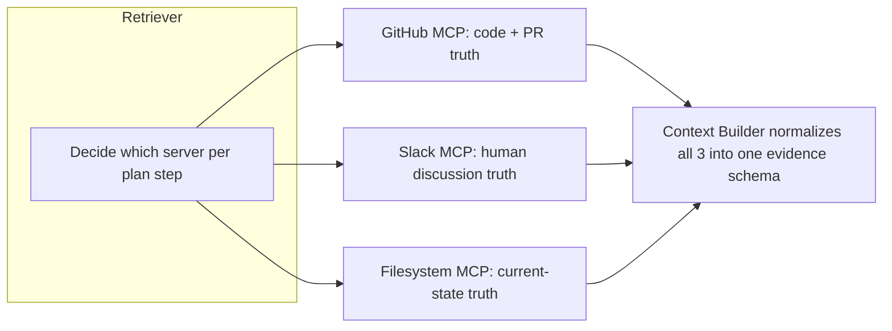

# PART 3 — MCP ARCHITECTURE

## 3.1 MCP Server Scope

| Server | Status | Tag |
|---|---|---|
| GitHub MCP | Build for real (PRs, commits, files, diffs, reviewers) | **MVP** |
| Slack MCP | Build for real (search messages/threads in 1-2 demo channels) | **MVP** |
| Filesystem MCP | Build for real (read local repo files for ownership/dependency parsing) | **MVP** |
| Documentation MCP (Notion/Drive) | Mock with a small fixture doc set | **Recommended** |
| Jira MCP | Not built | **Future Vision** |
| Calendar / Database / Terminal MCP | Not built | **Future Vision** |

**Engineering rationale:** Three deep, real integrations demo far better than six shallow/mocked ones — judges probe the thing you show them. A "Why Redis?" answer that cites a real PR and a real Slack thread is more convincing than five badly-integrated tools.

## 3.2 Tool Definitions (GitHub MCP — MVP)

```typescript
// Verified pattern from NitroStack docs (decorator-based tool definition)
import { Tool, ExecutionContext } from 'nitrostack';
import { z } from 'zod';

export class GitHubTools {
  @Tool({
    name: 'search_pull_requests',
    description: 'Search PRs by keyword, file path, or date range',
    inputSchema: z.object({
      query: z.string(),
      filePath: z.string().optional(),
      maxResults: z.number().default(5),
    }),
  })
  async searchPullRequests(input: any, ctx: ExecutionContext) {
    // calls GitHub REST/GraphQL API, returns normalized PR summaries
  }

  @Tool({
    name: 'get_file_history',
    description: 'Return commit history and diffs for a given file',
    inputSchema: z.object({ filePath: z.string() }),
  })
  async getFileHistory(input: any, ctx: ExecutionContext) {}

  @Tool({
    name: 'get_code_owners',
    description: 'Return recent authors/reviewers for a file or directory',
    inputSchema: z.object({ path: z.string() }),
  })
  async getCodeOwners(input: any, ctx: ExecutionContext) {}
}
```

**Verified:** The `@Tool` decorator, `ExecutionContext` parameter, and Zod-based `inputSchema` pattern shown above match NitroStack's documented and GitHub-published examples (`docs.nitrostack.ai`, `github.com/nitrocloudofficial/nitrostack`).
**Assumption — verify against official NitroStack documentation:** Exact method for registering `GitHubTools` inside an `@Module` and wiring real GitHub API auth (env-based vs. NitroStack-managed secrets) should be confirmed against the current CLI-scaffolded project template before Hour 1.

## 3.3 Tool Definitions (Slack MCP — MVP)

| Tool | Purpose |
|---|---|
| `search_messages` | Keyword + channel + date-range search |
| `get_thread` | Full thread by permalink or message ID |

## 3.4 Tool Definitions (Filesystem MCP — MVP)

| Tool | Purpose |
|---|---|
| `read_file` | Read a specific file's current contents |
| `list_directory` | List a directory for dependency/ownership scanning |
| `grep_codebase` | Keyword/symbol search across the repo (used by Impact Analysis) |

## 3.5 MCP Server Responsibility Boundaries



Each server owns exactly one "truth domain." The Context Builder never merges raw payloads — it converts every result into a common `EvidenceItem { sourceId, type, excerpt, url, timestamp }` shape before it reaches Claude. This is what makes citations reliable: the Reasoning Agent cites `sourceId`s, and the Response Generator resolves those back to real links.

## 3.6 Evidence Schema (shared contract)

```typescript
interface EvidenceItem {
  sourceId: string;        // stable id, e.g. "gh-pr-482"
  type: 'pr' | 'commit' | 'slack_thread' | 'file' | 'doc';
  excerpt: string;         // trimmed, relevant slice only — never full payload
  url: string;
  timestamp: string;
  relevanceScore: number;  // used by Context Builder to cap total evidence sent to Claude
}
```

**Implementation note:** Context Builder caps the bundle at a fixed evidence budget (e.g. top 8 items by `relevanceScore`) before calling Claude. This is the concrete mechanism behind the Token Strategy principle "retrieve only relevant context."

## 3.7 Security Considerations

- MCP servers run with least-privilege tokens: GitHub PAT scoped read-only to the demo repo; Slack bot token scoped to specific channels only.
- No MCP tool is allowed to perform writes (no `create_pr`, no `post_message`) in MVP scope — ContextOS is read/reason/recommend only for the hackathon. Write-capable tools (e.g., "post a Slack summary") are **Stretch Goal**, gated behind human-in-the-loop approval (see Part 6, NitroStack Integration).

## 3.8 Scalability Considerations (documented, not built)

| Concern | MVP approach | Future Vision |
|---|---|---|
| Multiple repos | Single hardcoded demo repo | Repo registry + per-repo MCP client pool |
| Rate limits at scale | N/A (single demo org) | Token-bucket rate limiter per MCP server, shared cache layer |
| Real-time sync | Polling on-demand at query time | Webhook-driven ContextNode background sync (Part 4) |

## 3.9 Risks

| Risk | Mitigation |
|---|---|
| GitHub/Slack API auth breaking day-of | Verify tokens and scopes the night before; keep `evidence_cache` fallback (Part 2) |
| Over-fetching blowing token budget | Hard cap in Context Builder (Section 3.6); Retriever enforces `maxResults` per tool call |

---

END OF PART 3

Awaiting Continue

