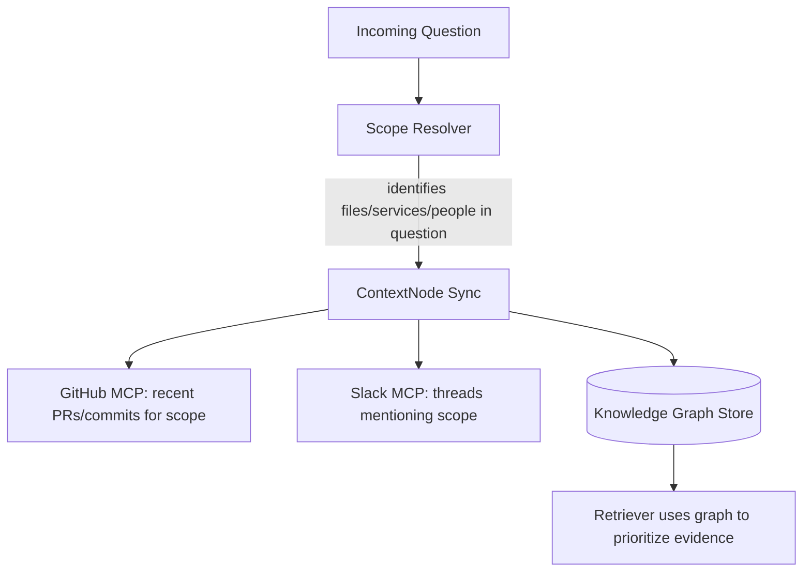

# PART 4 — CONTEXTNODE

## 4.1 Purpose

ContextNode is the **autonomous observer** subsystem: instead of ContextOS only reacting to questions, ContextNode continuously watches engineering activity and keeps the Knowledge Graph and Memory Store fresh, so that answers don't require re-retrieval from scratch every time.

## 4.2 Problem It Solves

Without ContextNode, every question is a cold-start retrieval — slow, and blind to relationships that span multiple events (e.g., "this file was touched in 3 PRs, discussed in 2 Slack threads, and owned by 2 people" is a *graph* fact, not a single-document fact).

## 4.3 MVP Scope vs. Full Vision

| Capability | Tag |
|---|---|
| On-demand graph build: when a question is asked, build/update the relevant subgraph (files touched, PRs, people, related Slack threads) | **MVP** |
| Scheduled/polling sync (e.g., every N minutes, pull new PRs/commits) | **Recommended** |
| Real-time webhook-driven sync (GitHub/Slack webhooks push events instantly) | **Stretch Goal** |
| Full historical backfill across entire repo lifetime | **Future Vision** |

**Why this scoping wins the demo:** True "continuous background observation" is impressive to describe but risky to demo live (webhook infra, timing). Building the graph **on-demand, scoped to the query**, produces the *same visible result* in the Knowledge Graph UI panel — judges see a live-updating graph — without the infra risk of always-on background workers during a 24-hour build.

## 4.4 ContextNode Architecture

## 4.5 Graph Schema

| Node type | Example |
|---|---|
| `File` | `src/services/checkout.ts` |
| `Service` | `CheckoutService` |
| `PullRequest` | `#482` |
| `Person` | `@alice` |
| `Decision` | `"Use Redis for session cache"` |
| `SlackThread` | permalink |

| Edge type | Meaning |
|---|---|
| `MODIFIES` | PR → File |
| `AUTHORED_BY` | PR/Commit → Person |
| `DISCUSSED_IN` | Decision → SlackThread |
| `DEPENDS_ON` | Service → Service |
| `IMPLEMENTS` | File → Decision |

## 4.6 Implementation Notes (step-by-step, beginner-level)

**Step 1 — Scope Resolver**
- What to do: parse the incoming question for file paths, service names, or keywords (simple keyword/entity extraction; Claude can do this as part of the Planner step rather than a separate NLP model).
- Why: without scoping, ContextNode would need to sync the entire repo, violating the retrieve-narrow principle.
- Expected result: a short list like `["CheckoutService", "src/services/checkout.ts"]`.
- Common mistake: trying to build a full NER pipeline — overkill for a 24-hour build. Use a Claude call with a tight prompt instead.
- Deliverable: `resolveScope(question: string): string[]`.

**Step 2 — Targeted Sync**
- What to do: call GitHub/Slack MCP tools filtered to the resolved scope only (e.g., `search_pull_requests({ filePath: 'src/services/checkout.ts' })`).
- Expected result: a small, bounded evidence set.
- Deliverable: populated `context_nodes` / `context_edges` rows for this scope.

**Step 3 — Graph Upsert**
- What to do: write/update nodes and edges idempotently (upsert on `sourceId`).
- Common mistake: duplicate edges on repeated queries — enforce a unique constraint on `(from_node, to_node, edge_type)`.
- Deliverable: queryable graph that the Knowledge Graph UI panel renders directly.

## 4.7 Developer Assignment

### Developer 1
Scope Resolver + integration into Planner agent.

### Developer 3
Graph upsert logic + `context_nodes`/`context_edges` schema and queries.

### Developer 4
Knowledge Graph UI panel (force-directed graph rendering, live-updates as ContextNode syncs).

### Developer 2
Wires ContextNode output into Retriever's relevance scoring (graph-adjacent evidence gets a relevance boost).

**Merge point:** ContextNode's graph write (Dev 3) must land before Dev 4's UI panel can render real data — Dev 4 builds against a fixture graph JSON in parallel, then swaps to the live endpoint at the merge point (~Hour 10, see Part 7).

## 4.8 Demo Perception

This is what makes "engineering memory" feel *alive* rather than "a chatbot with search." Watching the graph visibly grow as ContextNode processes a question is a strong visual moment for Demo 2 (Impact Analysis) and Demo 3 (Timeline).

**Tag: MVP** (on-demand scoped sync + graph render). Scheduled/webhook sync: **Recommended / Stretch Goal** respectively.

---

END OF PART 4

Awaiting Continue
