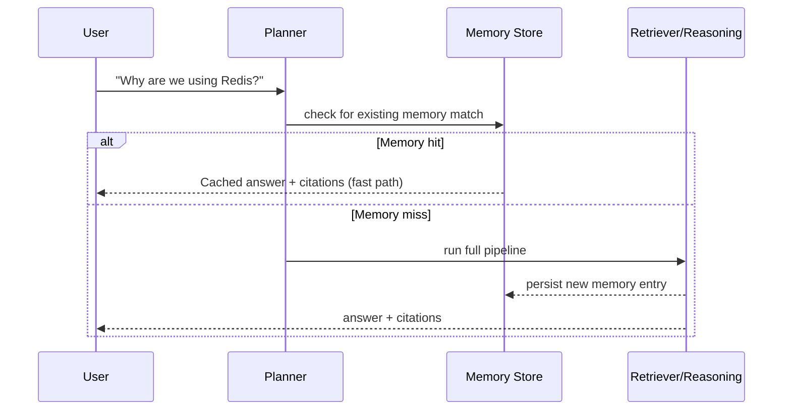

# PART 5 — CORE FEATURES

Each feature includes: problem, solution, demo mapping, and tag.

## 5.1 Feature Matrix

| Feature | Tag | Demo mapping |
|---|---|---|
| Engineering Memory (Q&A with citations) | **MVP** | Demo 1 — "Why are we using Redis?" |
| Explain Code | **MVP** | Supports Demo 1 |
| Impact Analysis | **MVP** | Demo 2 — "What happens if I modify CheckoutService?" |
| Knowledge Graph (visual) | **MVP** | Demo 2 + Demo 3 |
| Context Timeline | **MVP** | Demo 3 — "How did authentication evolve?" |
| Code Ownership | **Recommended** | Enriches Demo 2 (suggested reviewers) |
| Decision Memory (ADR extraction) | **Recommended** | Enriches Demo 1 and 3 |
| AI Project Manager | **Recommended** | Standalone judge Q&A moment |
| Duplicate Detection | **Stretch Goal** | Not in core demo |
| Root Cause AI | **Stretch Goal** | Not in core demo |
| Cross-Repository Search | **Future Vision** | N/A (single-repo hackathon) |
| Meeting Intelligence | **Future Vision** | Requires Calendar/transcript MCP — out of scope |
| Release Notes Generator | **Future Vision** | Nice enterprise upsell, not demo-critical |
| Architecture Decision Records (auto-generated doc output) | **Recommended** | Strong "wow" artifact to show judges post-demo |
| Engineering Health Dashboard | **Future Vision** | Enterprise pitch, not hackathon build |
| Engineering Dashboard (basic) | **Stretch Goal** | Optional summary screen |
| Incident Timeline | **Future Vision** | Requires PagerDuty/monitoring MCP |
| Dependency Explorer | **Recommended** | Powers Impact Analysis under the hood |

## 5.2 Engineering Memory — Detail

**Problem:** The same question gets asked repeatedly with no durable answer.
**Solution:** Every answered question is persisted as a `memory_entries` row with its evidence citations; future matching questions retrieve the memory directly (fast path) instead of re-running the full pipeline.

**Why this wins:** Live, visible speed difference between a first-ask (slow, full pipeline, visible tool calls) and a repeat-ask (instant, "I remember this") is a great demo beat — literally show the same question twice.

## 5.3 Impact Analysis — Detail

**Problem:** Engineers don't know the blast radius of a change until it breaks something.
**Solution:** Given a file/service, walk `DEPENDS_ON` and `MODIFIES` edges in the Knowledge Graph, cross-reference recent PR authors (`Code Ownership`), and produce a risk-tagged summary.

**Implementation notes:**
- Dependency detection for MVP: static import/require scanning via Filesystem MCP `grep_codebase`, not a full AST/type-level analysis (that's **Future Vision** — real static analysis tooling).
- Risk scoring for MVP: simple heuristic (number of dependents × recency of last change × number of distinct owners) rather than an ML model.

**Alternatives considered:** Full AST-based dependency graph (e.g., via `ts-morph`).
**Why not for MVP:** High implementation cost for 24 hours; grep-based import scanning gets ~80% of the demo value for ~20% of the effort.

## 5.4 Context Timeline — Detail

**Problem:** Understanding *how* something evolved requires manually stitching together commits, PRs, and discussions in chronological order.
**Solution:** Query all evidence types scoped to a topic (e.g., "authentication"), sort by timestamp, and render as a horizontal timeline with citation cards at each point, ending in a Claude-generated narrative summary of the evolution.

## 5.5 Explain Code — Detail

**Problem:** Reading code tells you *what*, not *why*.
**Solution:** Given a file/function selection, retrieve the PR that introduced/last modified it + any linked Slack discussion, then have Claude explain the code **with that history as grounding**, not just static code explanation.

**Differentiator vs. Copilot-style explain:** Standard code explainers only see the code. ContextOS's Explain Code always attaches the *why* — this is the single clearest "not a chatbot" demo moment if judges ask "how is this different from Copilot?"

## 5.6 AI Project Manager — Detail

**Problem:** Status updates and "what's blocking what" require manual synthesis across GitHub/Slack.
**Solution:** A scoped query mode: "What's the status of the checkout redesign?" → pulls open/merged PRs, related Slack threads, and produces a structured status summary (done / in progress / blocked / needs review) with citations.

**Tag: Recommended** — valuable but not on the critical path of the three scripted demos; build after MVP is solid.

## 5.7 Decision Memory / ADR Generator — Detail

**Problem:** Architecture decisions are made in Slack/PR discussions and never formalized.
**Solution:** Detect decision-shaped evidence (heuristic: PR/thread contains comparison language + a clear resolution) and generate a lightweight ADR (Context, Decision, Consequences) as a downloadable markdown artifact.

**Demo perception:** A strong leave-behind artifact — literally hand judges a generated ADR document at the end of the demo. High "startup potential" signal.

---

END OF PART 5

Awaiting Continue
