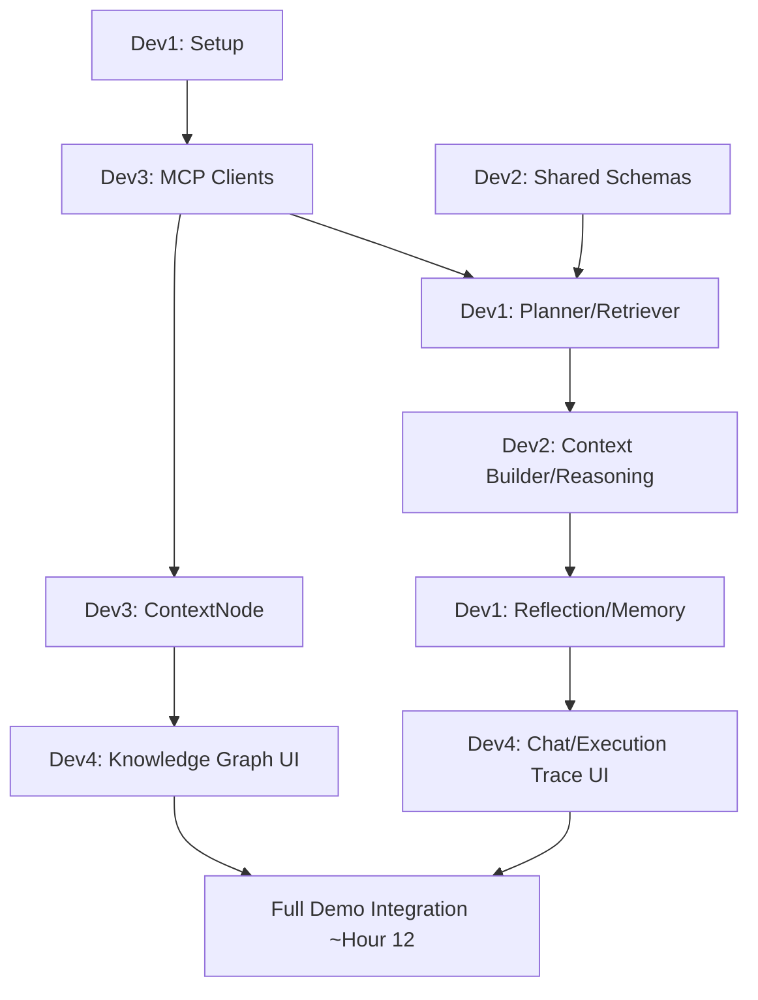

# PART 7 — TEAM MODE & 24-HOUR EXECUTION

## 7.1 Team Roles (fixed for the hackathon)

| Dev | Primary ownership |
|---|---|
| **Developer 1** | Planner + Reflection agents, NitroStack CLI/project setup, tool registration |
| **Developer 2** | Context Builder, Memory Manager, shared Zod schemas, evidence-scoring logic |
| **Developer 3** | MCP clients (GitHub, Slack, Filesystem) + ContextNode graph upsert |
| **Developer 4** | React frontend: Chat panel, Knowledge Graph viz, Execution Trace viz, Citation cards |

## 7.2 24-Hour Timeline

| Hours | Goal | Deliverables | Owners | Risks | Fallback |
|---|---|---|---|---|---|
| 0–1 | Project setup | NitroStack project scaffolded (CLI-verified), repo structure per Part 2, env/secrets loaded | Dev 1 | CLI command mismatch vs. assumed docs | Fall back to manual `@McpApp`/`@Module` setup per GitHub README example |
| 1–3 | MCP clients skeleton | `search_pull_requests`, `get_file_history`, `search_messages`, `read_file` tools return real (not mocked) data in NitroStudio | Dev 3 | API auth friction | Use fixture JSON responses behind the same interface, swap later |
| 1–3 (parallel) | Shared schemas | `EvidenceItem`, `MemoryEntry`, graph node/edge types in `packages/shared-types` | Dev 2 | — | — |
| 1–4 (parallel) | Frontend shell | Chat panel UI with mock data, routing, layout | Dev 4 | — | — |
| 3–6 | Planner + Retriever | Planner produces tool plans from a question; Retriever executes real MCP calls and returns evidence bundles | Dev 1 + Dev 3 | Planner over- or under-calling tools | Hardcode plan templates for the 3 demo questions as a safety net |
| 6–9 | Context Builder + Reasoning Agent | Evidence normalized to `EvidenceItem`; first end-to-end Claude answer with citations for Demo 1 question | Dev 2 + Dev 1 | Citation format drifting from schema | Strict Zod-validated output parsing with retry |
| 6–10 (parallel) | ContextNode | Scope Resolver + graph upsert working for at least the CheckoutService scope | Dev 3 | — | — |
| 9–12 | Reflection + Memory | Unsupported-claim detection working; memory persistence + fast-path re-ask demo working | Dev 1 + Dev 2 | — | — |
| 10–14 (parallel) | Knowledge Graph + Execution Trace UI | Live graph rendering from real ContextNode data; execution trace showing pipeline steps in real time | Dev 4 | Graph library performance with live updates | Cap rendered nodes to scoped subgraph only (never full graph) |
| **Merge point** ~Hour 12 | Full pipeline demo-ready for Demo 1 | End-to-end "Why Redis?" run works live | All | Integration bugs | Freeze scope; no new features until Demo 1 is bulletproof |
| 12–16 | Impact Analysis + Demo 2 | Dependency scan (grep-based) + risk scoring + reviewer suggestion working | Dev 3 + Dev 1 | Grep-based dependency detection missing edge cases | Curate demo repo so scanned dependencies are clean and predictable |
| 14–17 (parallel) | Context Timeline + Demo 3 | Timeline query + narrative summary working for "authentication" topic | Dev 2 + Dev 4 | — | — |
| 16–19 | Recommended features (if on schedule) | Code Ownership, ADR generator | Dev 2 + Dev 3 | Scope creep | Cut immediately if Demo 1–3 aren't rock solid |
| 19–21 | Polish pass | UI polish, citation card styling, loading states, error states | Dev 4 | — | — |
| 19–21 (parallel) | Reliability pass | Pre-fetch & cache all demo-path evidence; disable any live network calls with flaky history | Dev 1 + Dev 3 | Live demo network failure | `evidence_cache` fallback (Part 2) active by default in demo mode |
| 21–22 | Full run-throughs | Run all 3 demo flows back-to-back, 3+ times | All | Timing drift, nerves | Script exact spoken narration alongside actions |
| 22–23 | Deck + storytelling | Slides mapped to Part 1's judging-lever strategy | All | — | — |
| 23–24 | Buffer / sleep-adjacent contingency | Freeze code. No commits after this point except critical demo-breaking fixes | All | Last-minute regressions | Hard code freeze enforced by Dev 1 |

## 7.3 Dependency Graph Across Devs

## 7.4 Checklists

**Hour 12 checkpoint — must be true before proceeding to Demo 2/3 work:**
- [ ] Demo 1 ("Why Redis?") runs end-to-end with real evidence and correct citations
- [ ] Execution trace visibly shows Planner → Retriever → Reasoning steps
- [ ] Memory fast-path demonstrably faster on re-ask
- [ ] No unhandled errors in a clean run

**Hour 21 checkpoint — go/no-go for feature freeze:**
- [ ] All 3 demo flows pass 3 consecutive clean runs
- [ ] Fallback caches populated and tested (simulate network failure)
- [ ] UI has no visible loading/error glitches in the demo path

---

END OF PART 7

Awaiting Continue
