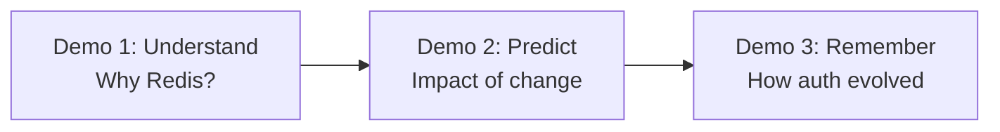

# PART 8 — DEMO SCRIPT

## 8.1 Narrative Arc

The three demos are sequenced deliberately to build a story: **Understand → Predict → Remember.**

## 8.2 Demo 1 — "Why are we using Redis?"

**Flow:** Planner → GitHub MCP + Slack MCP + Documentation MCP → Retriever → Evidence-based answer with citations.

**On screen:**
1. Type the question into the Chat panel.
2. Execution Trace panel lights up showing Planner deciding to call `search_pull_requests` and `search_messages`.
3. NitroStudio window (secondary screen/recording) briefly shown running the same tool calls live — proves it's real MCP, not scripted.
4. Answer streams in with inline citation chips linking to the actual PR and Slack thread.
5. Ask the *same question again* — instant memory-fast-path answer, visibly faster, labeled "recalled from engineering memory."

**Judge perception target:** "This isn't summarizing docs — it's reasoning over real evidence, and it doesn't forget."
**Tag: MVP**

## 8.3 Demo 2 — "What happens if I modify CheckoutService?"

**Flow:** Dependency Analysis → Knowledge Graph → Impact Analysis → Suggested reviewers → Risk Assessment.

**On screen:**
1. Ask the question.
2. Knowledge Graph panel animates: nodes for `CheckoutService`, its dependents, and recent PR authors appear and connect live (this is ContextNode, Part 4, working in real time).
3. Impact Analysis returns a risk-tagged summary: which services are affected, how recently they changed, who should review.
4. Suggested reviewers shown as avatars pulled from real Code Ownership data.

**Judge perception target:** "It doesn't just answer questions — it prevents incidents before they happen."
**Tag: MVP**

## 8.4 Demo 3 — "Show me how authentication evolved."

**Flow:** Timeline → Commits → PRs → Architecture Decisions → Current State.

**On screen:**
1. Ask the question.
2. A horizontal timeline renders with citation cards at each milestone (initial implementation PR, a Slack debate, a refactor PR, the current state).
3. Claude-generated narrative summary appears beneath the timeline, in the tone of an engineer explaining history to a new hire.
4. Close with: "Generate ADR" button — produces a downloadable architecture decision record summarizing the evolution as a formal document, live, in front of judges.

**Judge perception target:** "This is organizational memory, not a search index — and it turns into a real artifact." This is also the strongest **startup potential** beat — show the downloaded ADR file as the closing image.
**Tag: MVP** (timeline) / **Recommended** (ADR generation button)

## 8.5 Delivery Notes

- Keep total live demo under 4–5 minutes; rehearsed narration should match Part 7's Hour 21–22 run-throughs exactly.
- Have the NitroStudio window and Execution Trace panel ready to switch to instantly — do not fumble window switching live; use a single pre-arranged screen layout.
- Always have the Hour 19–21 fallback cache active during the actual judged demo — never depend on live third-party API calls in front of judges (Part 2, Risks).

---

END OF PART 8

Awaiting Continue
