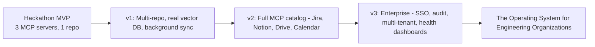

# PART 10 — STARTUP VISION & FUTURE ROADMAP

## 10.1 From Hackathon MVP to Company

## 10.2 Why This Is a Company, Not a Feature

- **Wedge:** every engineering org already has GitHub + Slack; ContextOS layers on top without requiring migration.
- **Compounding data moat:** the longer an org uses ContextOS, the more durable engineering memory accumulates — a genuine defensibility story, not just a UI wrapper on an LLM.
- **Expansion path:** starts as a developer tool (bottom-up adoption via a single team), naturally expands to an engineering-org-wide platform (top-down enterprise sale) once Decision Memory and Engineering Health features mature.

## 10.3 Business Model Sketch (for pitch, not built)

| Tier | Audience | Feature set |
|---|---|---|
| Free / Team | Small teams | GitHub + Slack MCP, Engineering Memory, Explain Code |
| Pro | Growing startups | + Impact Analysis, ADR generation, Knowledge Graph |
| Enterprise | Large orgs | + Full MCP catalog, SSO, audit logging, Engineering Health Dashboard, on-prem/VPC deployment |

## 10.4 Immediate Post-Hackathon Roadmap (documented, not built during event)

1. Real vector DB + embedding pipeline (replace in-memory cosine similarity)
2. Webhook-driven ContextNode sync (replace on-demand scoped sync)
3. Jira + Notion MCP servers
4. Write-capable tools behind human-in-the-loop approval
5. Multi-repo + multi-tenant architecture

---

END OF PART 10

END OF PROJECT BIBLE

Awaiting Continue
